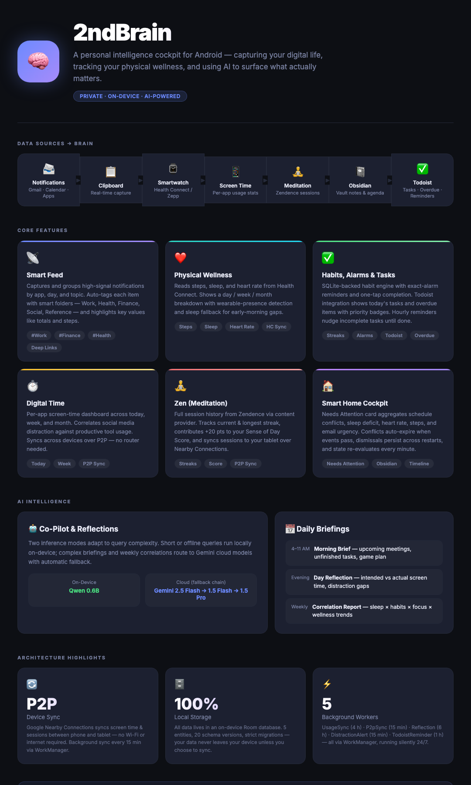

# 2ndBrain 🧠
2ndBrain is a personal productivity cockpit for Android. It captures high-signal data from your daily digital life—notifications, clipboard snippets, smartwatch logs, app usage, and meditation sessions—into a private local store. It then leverages advanced AI to provide proactive advice, daily briefings, and insights into your routine.

## ✨ Key Features

### 📡 Smart Capture (Notifications & Clipboard)
- **Automatic Logging**: Captures and groups notifications from high-signal apps like Gmail, Calendar, and Todoist.
- **App-Specific Deep Linking**: Instantly jump from a capture back to the original email, calendar event, or task.
- **Strict Monitoring**: Choose exactly which apps are allowed to enter your "Brain" via the granular Setup menu.
- **Instant Data Cleaning**: Unmonitoring or deselecting an app instantly cleans up and deletes all its historical notifications and usage statistics from the database.
- **Duplicate Merging**: Smartly merges repetitive notifications to keep your feed clean.
- **Collapsible App & Day Feed**: Memory feed organizes captured events by app sources under collapsible daily sections, showing single-line quick summaries with direct launch/copy quick actions.
- **Smart Folders & Dynamic Tagging**: Dynamically tags incoming captures (e.g. `#Work`, `#Health`, `#Social`, `#Finance`, `#Reference`) and allows instant filtering via a glassmorphic top-level horizontal chip selector.
- **⚡ Real-Time Group Highlights**: Heuristically extracts high-signal values (such as physical steps or purchase dollars) and displays an aggregated group highlight (e.g. *"⚡ Logged 3 payments totaling $15.50."*).
- **Optimistic UI Updates**: Mark-as-read/unread actions are reflected instantly in the UI without waiting for a database round-trip, eliminating visible lag.
- **Individual Mark Unread**: Toggle individual messages back to unread from within any expanded app group.

### ⌚ Smartwatch & Physical Wellness (Health Connect)
- **Central Health Sync**: Integrates with Android **Health Connect** to seamlessly read smartwatch wellness data (e.g., Google Fit, Samsung Health, Zepp/Amazfit).
- **Physical Insights Dashboard**: Home cockpit renders steps walked today, sleep duration last night, and active heart rate zones (min/max/avg) in real-time.
- **Physical-Digital Correlation**: Correlates your sleep and physical activity metrics with your digital focus and routine tasks to compute your custom **Sense of Day Score** (HSV-mapped progress ring).

### ⏰ Dynamic Medication Reminders & Routine Alarms
- **SQLite-Backed Habit Engine**: Dynamic scheduling and persistence of custom daily habits, medication times, and routines.
- **Proactive Notification Alarms**: Reminders triggered using exact alarms via Android's `AlarmManager` with automatic boot-rescheduling.
- **Dynamic Quick-Actions**: Tapping `[ Done ]` or `[ Take Meds ]` directly from the notification shade (or paired smartwatch) registers completion logs in the background without needing to launch the app.
- **Streak & Performance Visualizer**: Cockpit presents a weekly progress strip featuring **7 beautifully styled circular HSL progress rings** representing routine completion over the past 7 days.
- **AI Co-Pilot Integration**: Today's checked-off routines and alarms are automatically injected into the AI Reflection/Briefing prompt context so your co-pilot can track your physical habits.

### 📋 Todoist Task Management
- **Today's Tasks Panel**: Live Todoist tasks due today displayed on the Home cockpit with priority-color-coded checkboxes (red = urgent, orange = high, blue = medium). Complete tasks directly from the app.
- **Overdue Actions Card**: Dedicated dashboard card showing the count of past-due Todoist tasks. Tapping opens a sheet listing each overdue item with its original due date highlighted in red and a one-tap complete button.
- **Hourly Task Reminders**: WorkManager-backed hourly notifications (7 AM–10 PM) fire whenever incomplete tasks remain for today. The first reminder fires immediately on app open; subsequent ones are rate-limited to once per hour so you're nudged — not spammed.
- **Unified Completion**: Completing a task from 2ndBrain closes it in Todoist via the REST API and removes it from both the today and overdue lists instantly — no refresh needed.

### 🧘 Zen (Meditation) — Powered by Zendence
- **Zendence Integration**: Reads real meditation session data via a content provider bridge to the companion Zendence app.
- **Session History**: Displays a full history of meditation sessions including duration, insight notes, and timestamps in a dedicated **Zen** tab.
- **Streak Tracking**: Tracks your current and longest meditation streaks with a live streak indicator on the Home cockpit.
- **Meditated Today indicator**: Home cockpit updates in real time to reflect whether you've meditated today, contributing to your Sense of Day Score (+20 pts).
- **P2P Zen Sync**: Meditation sessions are automatically included in the Nearby Connections P2P sync payload. When a sync completes, the Zen tab refreshes instantly — no manual action required.

### 🏠 Home Cockpit & Needs Attention
- **Needs Attention Card**: Aggregates urgent signals — imminent calendar events (≤15 min), sleep deficit, elevated heart rate, low step count, overdue email, and schedule conflicts — into a single prioritised card with red/amber/green colour coding.
- **Auto-Expiring Schedule Conflicts**: "Schedule Crunch" alerts automatically disappear once both conflicting events have passed — no stale warnings lingering all day.
- **Persistent Dismissals**: Dismissed conflicts survive app restarts and auto-clear at midnight; each conflict ID is stored in SharedPreferences keyed by today's date.
- **Live Recomputation**: Conflict state re-evaluates every minute via a ticker flow, so time-sensitive alerts stay accurate without requiring a data change to trigger a refresh.

### 🤖 AI Intelligence & Private Co-Pilot
- **💬 Interactive Co-Pilot Chat**: A beautiful sidebar-driven bubble log to ask direct questions about your captures, clipboard logs, and daily usage. It pulls relevant DB context in real-time.
- **🔍 Concept-Expanding Semantic Search**: Intercepts queries (like "workout", "gmail", "spending") and matches their underlying semantic intent against smart folder tags.
- **Dynamic Context Routing**: Automatically selects between on-device (Qwen-0.6B via LiteRT) and cloud (Gemini API) models based on query length and complexity to prevent overload and maximize quality.
- **Morning Briefings**: Generates a "game plan" between 4 AM - 11 AM based on upcoming meetings and yesterday's unfinished tasks.
- **Evening Reflections**: Analyzes how your day actually went by comparing your intended tasks with your actual screen time.
- **Conflict Detection**: Flags "Distraction Gaps" where significant time was spent on non-productive apps during busy work windows.
- **Customizable Models**: Dynamically downloads and runs local offline **LiteRT** models or connects securely to remote Gemini APIs directly configured inside Settings.

### 🕒 Digital Time & Nearby Sync
- **📊 Habit Correlation Engine**: An active insight block correlating distraction trends (like spending 60+ mins on social media apps) against focused productivity tool usage.
- **Direct P2P Device Sync**: Secure peer-to-peer bidirectional sync of **screen time statistics and meditation sessions** between your nearby devices using the **Google Nearby Connections API** (no internet or local router connection required).
- **Settings-Based Sync Control**: Sync is managed from the Settings tab — start, stop, and monitor connection status without leaving the app.
- **Automatic UI Refresh**: After a sync completes, Digital Time and Zen screens refresh automatically without manual intervention.
- **Periodic Background Sync**: Automatically triggers a background sync session every 15 minutes via **WorkManager**, featuring safety guards to skip execution while the app is in the foreground to prevent UI conflicts.
- **Consolidated View**: See total time spent per app across your entire device ecosystem.
- **Visual Charts**: Beautiful, modern bar charts showing your usage distribution.
- **Time Series Reports**: Toggle between Today, This Week, and This Month views.

### 🗒️ Obsidian Integration
- **Vault Explorer**: Navigate your Obsidian folders and read Markdown notes directly inside the app.
- **Deep Linking**: Open any note in the Obsidian app for editing with a single tap.
- **Quick Capture**: Create new notes in your vault with an automated timestamped template.
- **Timeline Filtering**: Agenda files and daily logs in your Obsidian vault are automatically filtered and excluded from the Schedule & Timeline screen if Obsidian is set to unmonitored.

---

## 🎨 Modern Design
- **Craft-Inspired UI**: Minimalist aesthetic with hero headers and pastel accent coding.
- **Sidebar Navigation**: Efficient vertical `NavigationRail` for quick switching between Home, Feed, Brain, Notes, Time, Zen, Co-pilot, and Settings.
- **Responsive Feedback**: Real-time loading indicators for AI generation, data syncing, and offline thinking models.

---

## 🛠️ Project Structure
- `ui/chat/`: Interactive Q&A Co-Pilot bubble logs and thinking indicators.
- `ui/memories/`: Collapsible notification feeds, quick actions, and filter chips.
- `ui/reflection/`: AI history, dynamic model downloading, and briefing/reflection cards.
- `ui/usage/`: Digital Time dashboard, visual charts, and Nearby Sync cards.
- `ui/notes/`: Obsidian vault explorer and markdown preview.
- `ui/meditation/`: Zen tab displaying meditation session history and streaks.
- `ui/settings/`: Sync controls, habit management, theme, and app monitoring configuration.
- `core/sync/`: Nearby Connections P2P manager (usage + meditation payload) and WorkManager background sync workers.
- `core/usage/`: `UsageStatsManager` local usage collection, SQLite usage database repository, and `DistractionAlertWorker`.
- `core/reflection/`: Gemini API, LiteRT on-device LLM picker, and briefing logic.
- `core/capture/`: Notification listener service and clipboard manager with heuristic auto-tagging.
- `core/health/`: Health Connect bridge for step count, sleep, and heart-rate tracking.
- `core/meditation/`: Zendence content provider bridge and meditation session repository.
- `core/todoist/`: Todoist REST API client (`TodoistRepository`), data model, and `TodoistReminderWorker` for hourly background reminders.

---

## 🚀 Build and Run
1. Open the project in Android Studio and sync Gradle.
2. Provide `gemini.api.key` (optional) in `local.properties` or the in-app Setup screen.
3. Every build automatically increments the version (e.g., `1.0.4`), visible in the Sidebar.
4. **Permissions**:
   - Enable **Notification Access** to capture events.
   - Enable **Usage Access** for Digital Time tracking.
   - Enable **Health Connect Permissions** inside the Home tab.
   - Select your **Obsidian Vault** folder in the Notes tab to enable syncing.
   - Grant **Nearby Devices & Location Permissions** inside the Settings screen to enable P2P device sync.
   - Install the companion **Zendence** app on the same device to enable Zen session sync.

---
*Your private data stays local or in your own vault. No cloud servers required.*

